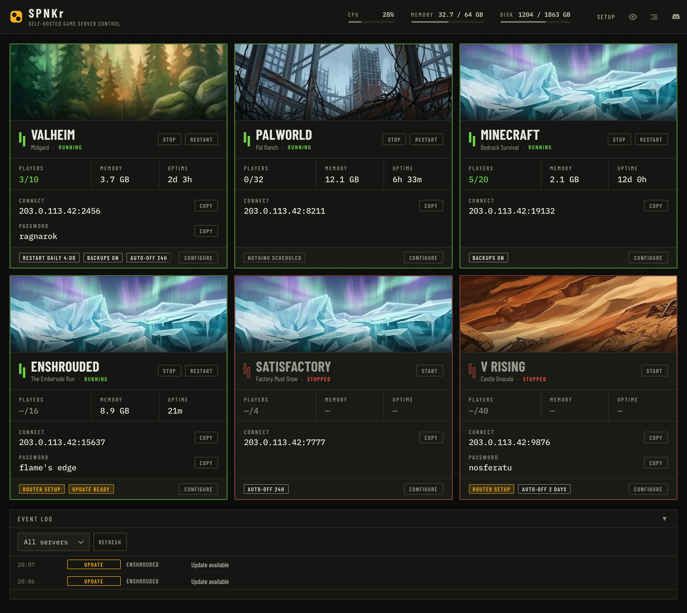
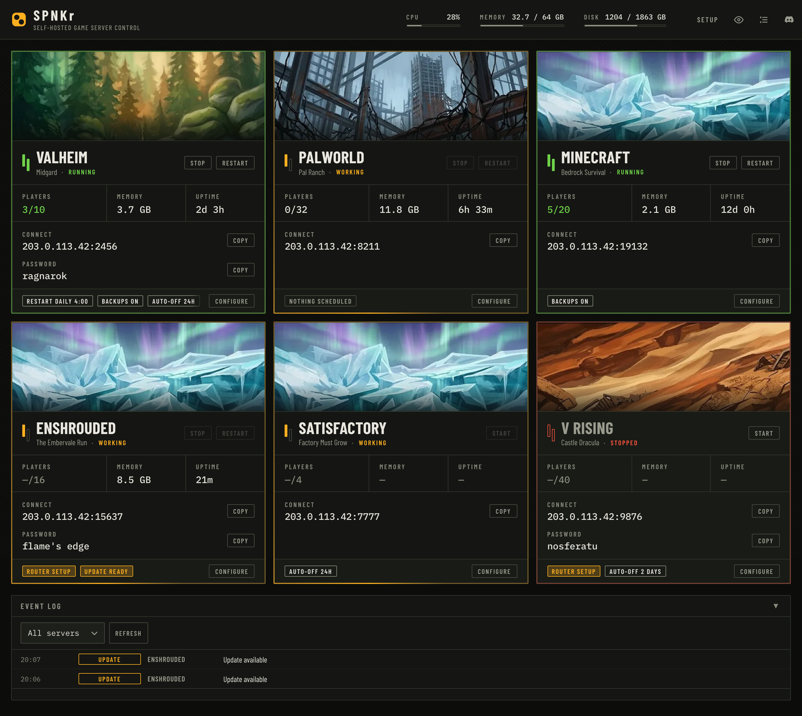
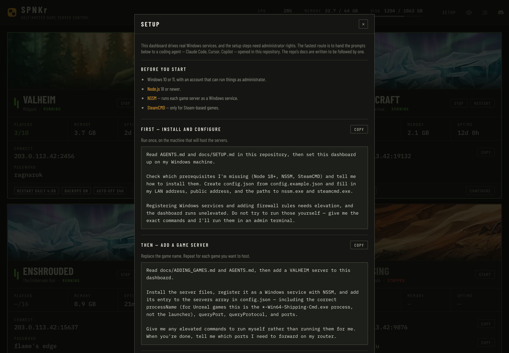
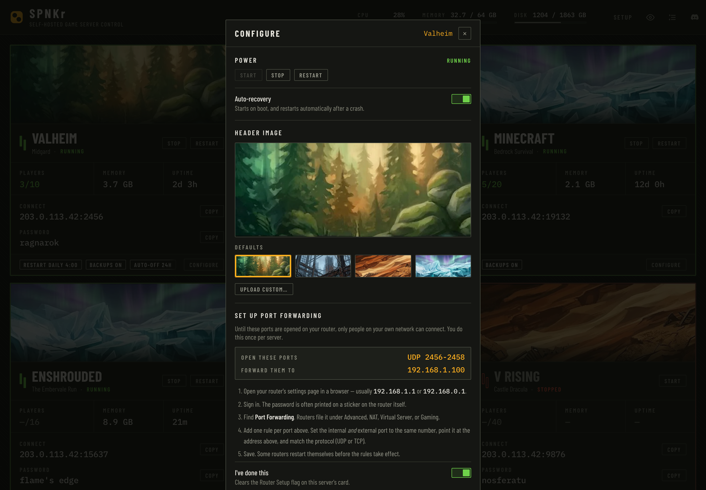
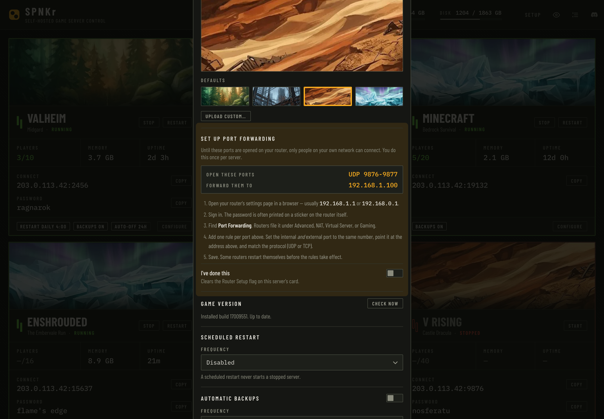
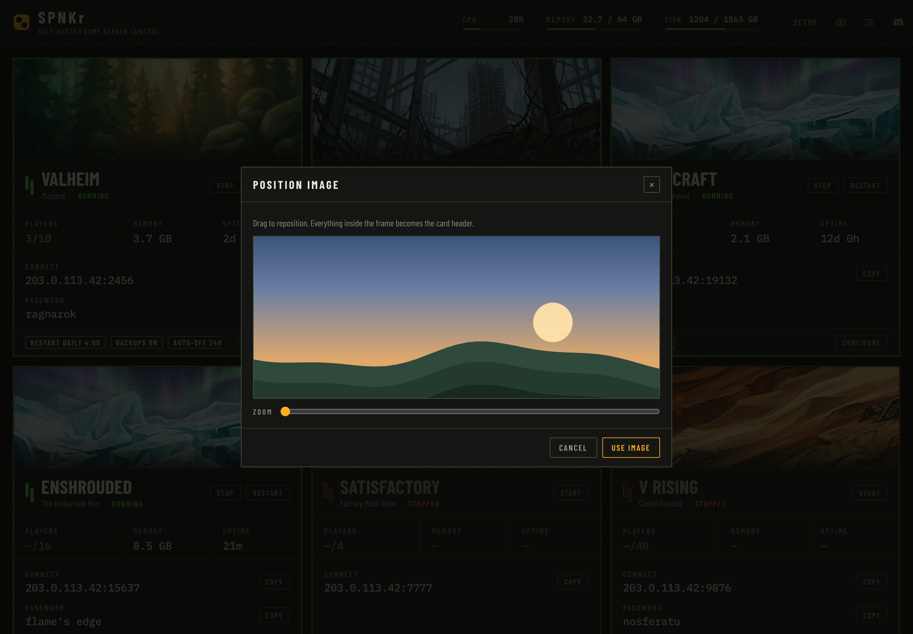
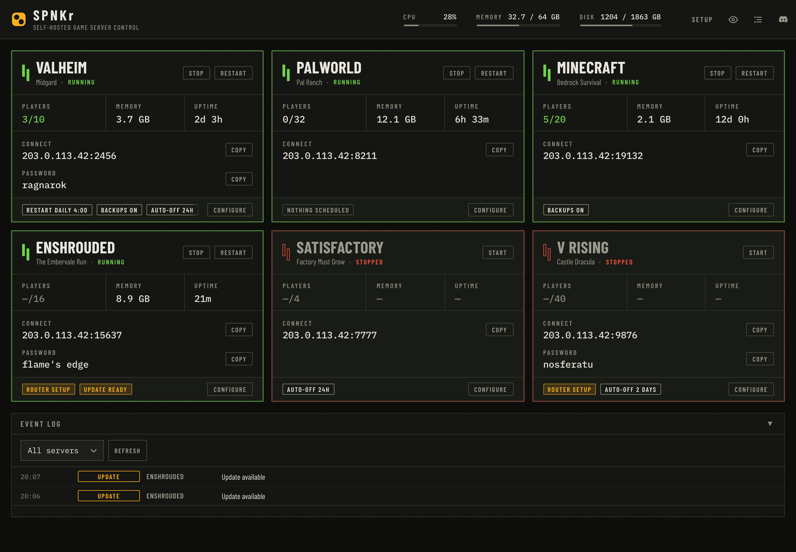

# SPNKr

**Self-hosted game server control.** Start, stop, and monitor several dedicated
game servers on one Windows machine — from any device on your network, or from
Discord.

Built for the case where you and a handful of friends want a few dedicated
servers running at home, without paying a hosting company and without remoting
into a box every time somebody wants to play something.



---

## What it does

- **One plate per server** — run state, players online, memory, uptime, connect
  address and password, with copy buttons for the two things people actually ask
  you for.
- **Start / stop / restart** from the browser or from Discord slash commands.
- **Scheduled restarts** with countdown warnings posted to Discord.
- **Automatic backups** of save data on a cron schedule, with retention limits.
- **Crash detection** with rate-limited auto-restart.
- **Update detection** for SteamCMD games — checked twice daily, on demand from
  the UI, and installable in one click.
- **Auto-off when empty** — shut a server down after N hours with nobody on it
  so it isn't burning RAM all week. Anyone can wake it with `/start` in Discord.
- **Player counts** per game, using each game's native query protocol.
- **Discord notifications** for any of the above, individually mutable.

### Reading a card

State is legible before you read a word: the plate border and the two tubes
beside the name are keyed to run state, and a stopped server visibly recedes.

Chips along the bottom mean two different things. **Amber chips are things that
need doing** — `Router Setup`, `Update Ready` — and clicking one opens the panel
that resolves it. Neutral chips are standing arrangements: `Backups On`,
`Restart daily 4:00`, `Auto-Off 24h`.



---

## Requirements

- Windows 10 or 11, and an account that can run things as administrator
- [Node.js](https://nodejs.org) 18 or newer
- [NSSM](https://nssm.cc/download) — runs each game server as a Windows service
- [SteamCMD](https://developer.valvesoftware.com/wiki/SteamCMD) — for Steam games

## Quick start

```bash
git clone https://github.com/hparamore/game-server-dashboard.git C:\GameServers\SPNKr
cd C:\GameServers\SPNKr
npm install
copy config.example.json config.json
```

Edit `config.json` — set `network.publicAddress`, `network.lanAddress`, and the
`paths` to your NSSM and SteamCMD executables. Then:

```bash
npm start
```

Open `http://localhost:8080`. The `servers` array starts empty; the **Setup**
button in the dashboard walks you through adding your first game.

For the full walkthrough — including running the dashboard itself as a service
so it survives reboots — see [docs/SETUP.md](docs/SETUP.md).

---

## Try it without a Windows box

The dashboard proper needs Windows, because it drives real services through NSSM
and PowerShell. To see and work on the interface from any machine:

```bash
npm install
npm run demo
```

That serves the real frontend at `http://localhost:8080` against a synthetic
fleet of six servers. Nothing on your system is touched. It's how the UI is
developed and reviewed on macOS and Linux.

---

## Setting it up with a coding agent

The docs in `docs/` are written to be followed by a coding agent as much as by a
person, because the fiddly parts of this — installing dedicated servers,
registering Windows services, finding the right process name — are exactly what
an agent is good at.

The dashboard's **Setup** panel has the prompts ready to copy.



Open the repo in Claude Code, Cursor, or similar, and paste:

> Read AGENTS.md and docs/SETUP.md in this repository, then set this dashboard up
> on my Windows machine.
>
> Check which prerequisites I'm missing (Node 18+, NSSM, SteamCMD) and tell me
> how to install them. Create config.json from config.example.json and fill in my
> LAN address, public address, and the paths to nssm.exe and steamcmd.exe.
>
> Registering Windows services and adding firewall rules needs elevation, and the
> dashboard runs unelevated. Do not try to run those yourself — give me the exact
> commands and I'll run them in an admin terminal.

To add a game:

> Read docs/ADDING_GAMES.md and AGENTS.md, then add a **VALHEIM** server to this
> dashboard.
>
> Install the server files, register it as a Windows service with NSSM, and add
> its entry to the servers array in config.json — including the correct
> processName (for Unreal games this is the `*-Win64-Shipping-Cmd.exe` process,
> not the launcher), queryPort, queryProtocol, and ports.
>
> Give me any elevated commands to run myself rather than running them for me.
> When you're done, tell me which ports I need to forward on my router.

**Why the prompts say that.** The dashboard runs unelevated and genuinely cannot
register services or open firewall ports, so an agent that tries will fail
confusingly. `AGENTS.md` carries the architectural invariants — the ones that
break silently rather than loudly — so an agent that reads it first won't
reintroduce a bug the project already fixed once.

---

## Configuring a server

Everything for one server lives behind its **Configure** button: power and
auto-recovery, port forwarding, game version, restart schedule, backups, and
auto-off.



Port forwarding is the step that trips people up, so it has its own section with
your machine's actual LAN address filled in, and a flag on the card until you've
done it.



### Optional per-server keys

Beyond the fields in `config.example.json`:

| Key | What it does |
|---|---|
| `staticVersion` | A version string to show for games with no SteamCMD build id |
| `updateUrl` | Where updates come from for a game you patch by hand; linked from Configure |
| `queryProtocol` + `queryPort` | Omit **both** if the game has no player query — the card will say counts are unavailable rather than showing what looks like a failed lookup |

---

## Making it yours

Each server can carry a header image — one of four bundled banners, or your own
screenshot, cropped in the browser. Turn the whole thing off in **View Options**
if you'd rather have the dense view.

<p>
  
  
</p>

---

## Security

This dashboard has **no authentication**. Anyone who can reach it can start and
stop your servers and read your server passwords.

Keep it on your LAN. **Do not port forward port 8080.** If you need to reach it
from outside, use Tailscale, WireGuard, or a Cloudflare Tunnel with access
control.

Note that this is separate from forwarding your *game* ports, which you do need
to do — the dashboard walks you through that.

---

## Documentation

| File | What's in it |
|---|---|
| [docs/SETUP.md](docs/SETUP.md) | First install, config reference, running as a service, Discord setup |
| [docs/ADDING_GAMES.md](docs/ADDING_GAMES.md) | Adding a game server end to end, with per-game reference values |
| [docs/TROUBLESHOOTING.md](docs/TROUBLESHOOTING.md) | Known failure modes and their fixes |
| [AGENTS.md](AGENTS.md) | Architecture and the invariants that break silently |
| [ART-DIRECTION.md](ART-DIRECTION.md) | The binding visual spec for any UI change |
| [PRODUCT.md](PRODUCT.md) | Who this is for and why it exists |
| [WORK_STATUS.md](WORK_STATUS.md) | Running log of work sessions |

## Development

```bash
npm run demo          # the real frontend against a fake fleet, any OS
npm run design-check  # fail the build on anything that breaks ART-DIRECTION.md
npm run screenshots   # regenerate screenshots/ from the running demo
```

`design-check` and `screenshots` have **zero dependencies** — the Windows host
has nothing installed but Node.

## License

MIT
